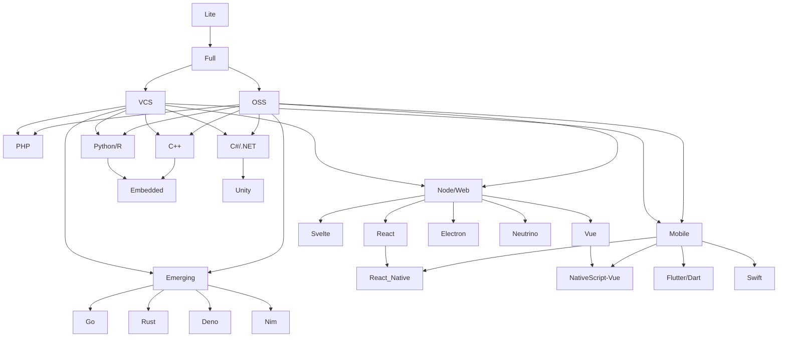

# Editor Config

> In the docs below, *Code* refers to [the open-source project by Microsoft](https://github.com/microsoft/vscode) as well as other projects that are based on the source code of *Code*. This includes VSCode, Codium.
>
> Where documentation is relevant to a specific *Code* distribution (i.e. VSCode or Codium, but not both), it will be noted. Otherwise assume the docs refer to both VSCode and Codium.

To put it as simply as possible, I usually prefer to use Code as my default IDE and Micro as my default `$EDITOR`. Sometimes I also play with Neo/Vim.

## Code

I tend to install both VSCode and Codium now. This is because if there is ever an issue with Codium, I prefer to not spend the time at work trying to fix it and need something I can drop into right away. This does mean though that I need to spend some time ensuring both editors behave similarly when setting up my dotfiles. That said, Codium is usually pretty rock solid, and I have found alternative ways (read: FOSS extensions 💪) to get 99% feature parity across both editors.

```bash
$ code --install-extension zokugun.sync-settings
```

### Desired features:

- [x] Live share (pair/mob programming support)
- [x] Remote SSH / Container
- [ ] Code Pair AI (akin to Github Copilot)
- [x] Synced settings without ties to one cloud provider
- [ ] 🚧 Support for "profiles" based on persona (home vs. work) and language

> Settings and extensions are managed using the [*Sync Settings*](https://open-vsx.org/extension/zokugun/sync-settings) extension. This was chosen over using the built-in sync feature of *VSCode* because the sync feature is unavailable to run on non-Microsoft builds of *Code* and is dependant on *GitHub*.

### Profiles:

The primary difference between profiles is the plugins that are available.



Symlink the `./profiles/oss/product.json` file to:

* **Windows:** `%APPDATA%\VSCodium\product.json` or `%USERPROFILE%\AppData\Roaming\VSCodium\product.json`
* **macOS:** `~/Library/Application Support/VSCodium/product.json`
* **Linux:** `$XDG_CONFIG_HOME/VSCodium/product.json` or `~/.config/VSCodium/product.json`

### Todo

- [ ] Configure "Markdown Preview Github Styling" to use dark mode
- [ ] Create solid keybindings (using <kbd>⌃Space</kbd> as leader)
- [ ] Differntiate between similar but different subdirectories
  - [ColorTabs](https://marketplace.visualstudio.com/items?itemName=orepor.color-tabs-vscode-ext) is promising, but cannot style anything I have showing. Have submitted a [feature request (#68)](https://github.com/oreporan/color-tabs-vscode/issues/68).

**Find extensions for:**

- [x] ~~Emoji in Markdown~~ (Using Espanso instead)
- [ ] Utilities / Dev toolbox
  - [ ] Regex editor/validator
  - [ ] Time conversion
  - Will create these as Powertool scripts/commands
- [ ] Better copy/paste (maybe integrate into OS instead?)
- [x] Todo lists
- [x] Markdown notes in Action bar
- [ ] Dash docs integration
- [x] Spell checking (may need to investigate [Spell Right](https://marketplace.visualstudio.com/items?itemName=ban.spellright) if Code Spell Check is too slow)

### Language support

- [ ] **Markup Languages** (Part of Core Lite)
  - [ ] HTML
    - [x] CSS3 / Sass
  - [x] **Markdown**
    - [x] Mermaid
    - [x] Footnotes
    - [ ] Github theme <!-- Can I change theme based on git platform in current repo? -->
    - [ ] Stats <!-- Find a better word counter that ignores markup -->
    - [ ] YAML Frontmatter
    - [x] Maths
  - [x] MJML
  - [ ] Mustache
  - [x] JSON / YAML
  - [x] TOML
- [ ] **Data**
  - [ ] SQLite Browser
  - [ ] GraphQL
  - [ ] SQL ([SQL Tools?](https://vscode-sqltools.mteixeira.dev/en/home/))
  - [ ] Redis
- [ ] **Node / Typescript**
  - [ ] React
  - [ ] Vue
    - [ ] Volar
    - [ ] Configure [take-over mode](https://github.com/johnsoncodehk/volar/discussions/471)
- [ ] **Mobile**
  - [ ] React Native
  - [ ] Flutter
  - [ ] Swift
  - [ ] NativeScript Vue
- [x] **PHP**
  - [x] Laravel
- [ ] **Python**
  - [ ] R
  - [ ] [Quarto](https://quarto.org/)
  - [ ] Academic tools
  - [ ] Django
  - [ ] Flask
- [ ] **C/C++**
  - [ ] [Debugger](https://marketplace.visualstudio.com/items?itemName=ms-vscode.cpptools) (Intellisense disabled; plus [Test Explorer Adapter/s](https://github.com/hbenl/vscode-test-explorer#c))
  - [ ] [Syntax](https://marketplace.visualstudio.com/items?itemName=jeff-hykin.better-cpp-syntax)
  - [ ] [CMake](https://marketplace.visualstudio.com/items?itemName=twxs.cmake)
  - [ ] [Intellisense](https://marketplace.visualstudio.com/items?itemName=tdennis4496.cmantic) (with [Clangd](https://marketplace.visualstudio.com/items?itemName=llvm-vs-code-extensions.vscode-clangd))
  - [ ] **Embedded**
    - [ ] Arduino
    - [ ] ARM
- [ ] [**C#/.NET**](https://viatsko.github.io/awesome-vscode/#c-asp-net-and-net-core)
- [x] **Emerging** (aka "Other")
  - [x] Deno
  - [x] Nim
  - [x] Go
  - [x] Rust

## Micro

This is installed via Dropbear. I am not currently using any plugins, so there is nothing to do here.

## Vim

I should probably just not. Am I gonna not? 🤷‍♂️

## Other

- [ ] Investigate using [Sonarlint](https://www.sonarsource.com/products/sonarlint/)