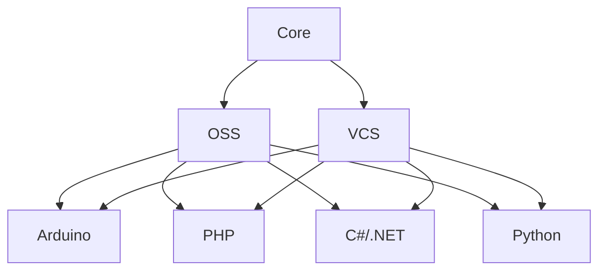

# Editor Config

> In the docs below, *Code* refers to [the open-source project by Microsoft](https://github.com/microsoft/vscode) as well as other projects that are based on the source code of *Code*. This includes VSCode, Codium.
> 
> Where documentation is relevant to a specific *Code* distribution (i.e. VSCode or Codium, but not both), it will be noted. Otherwise assume the docs refer to both VSCode and Codium.

To put it as simply as possible, I usually prefer to use Code as my default IDE and Micro as my default `$EDITOR`. Sometimes I also play with Neo/Vim.

## Code

I tend to install both VSCode and Codium now. This is because if there is ever an issue with Codium, I prefer to not spend the time at work trying to fix it and need something I can drop into right away. This does mean though that I need to spend some time ensuring both editors behave similarly when setting up my dotfiles. That said, Codium is usually pretty rock solid, and I have found alternative ways (read: FOSS extensions 💪) to get 99% feature parity across both editors.

### Desired features:

- [x] Live share (pair/mob programming support)
- [x] Remote SSH / Container
- [ ] Code Pair AI (akin to Github Copilot)
- [x] Synced settings without ties to one cloud provider
- [ ] 🚧 Support for "profiles" based on persona (home vs. work) and language

> Settings and extensions are managed using the [*Sync Settings*](https://open-vsx.org/extension/zokugun/sync-settings) extension. This was chosen over using the built-in sync feature of *VSCode* because the sync feature is unavailable to run on non-Microsoft builds of *Code* and is dependant on *GitHub*.

### Profiles:

The primary difference between profiles is the plugins that are available. 

Symlink the `./profiles/oss/product.json` file to:

* **Windows:** `%APPDATA%\VSCodium\product.json` or `%USERPROFILE%\AppData\Roaming\VSCodium\product.json`
* **macOS:** `~/Library/Application Support/VSCodium/product.json`
* **Linux:** `$XDG_CONFIG_HOME/VSCodium/product.json` or `~/.config/VSCodium/product.json`

### Todo

- [ ] Configure "Markdown Preview Github Styling" to use dark mode

**Find extensions for:**

- [ ] Emoji in Markdown (or use espanso emoji?)
- [ ] Better manage YAML preamble in Markdown
- [ ] Find a better Markdown word counter (needs to ignore markup)

## Micro

This is installed via Dropbear. I am not currently using any plugins, so there is nothing to do here.

## Vim

I should probably just not. Am I gonna not? 🤷‍♂️
