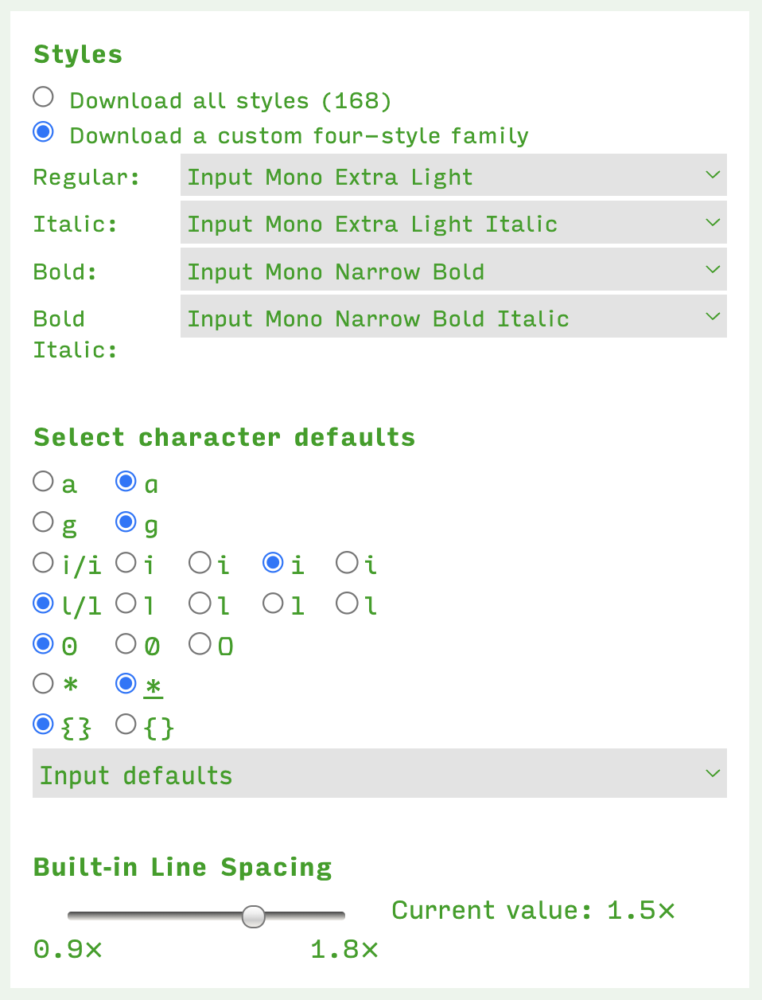

Note: This repo should only contain the fonts needed for terminals and code editors. Everything else will live elsewhere.

The patched directory contains the Input font configured with my preferred characters, weights and whitespacing options. See image for config options:



It has also been patched with Nerd Font icons:

```
# From $REPO/static/fonts
git clone https://github.com/ryanoasis/nerd-fonts.git --depth=1
./nerd-fonts/font-patcher -w -c --careful -l -out ./nerd Input/Input\ Bold\ Italic.ttf
```

I would like to take a look at the features from [Fira Code](https://github.com/tonsky/FiraCode) and implement some of them in Input. 

I would also like to implement a semibold weight because that works better on light themes.
